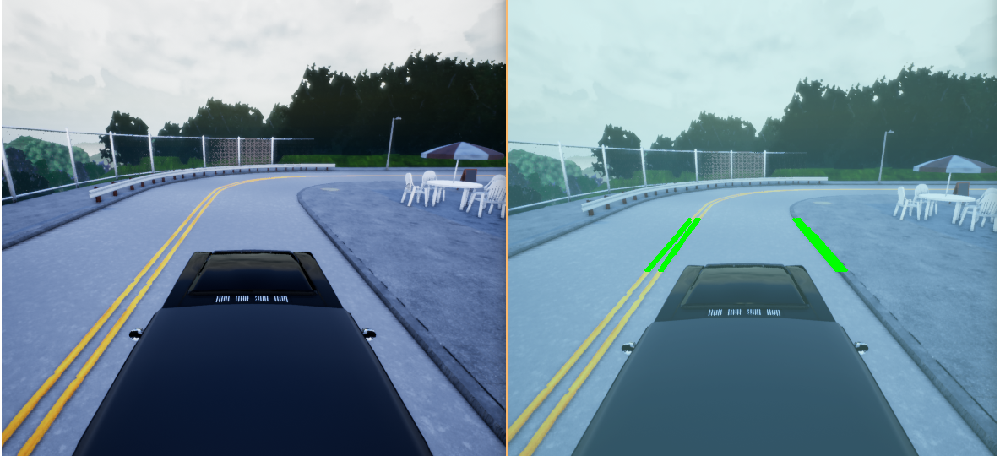

# Autonomous Car in Python

This project are one of my studies, where i'm trying to make an self-driving
 car, with openCV and Tensorflow in Python and Carla Simulator
 
## What has been done so far



## Usage

Its underwork, but, if you want, just run 

```
python mainv2.py
```

And place the game in a 600x600 windows, in the top-left 


## TODO

- Easy start, without need to change game resolution and position in screen
- Improve Lane Finder 
    - Fit Polynomial Equation on Curves
    - Improve the image processing for stable detection
- Pedestrian, vehicle and signs detection, probabily using YOLO
- Reinforcment learning for driving


## Contributing
Pull requests are welcome. For major changes, please open an issue first to discuss what you would like to change.


## License
[MIT](https://choosealicense.com/licenses/mit/)
